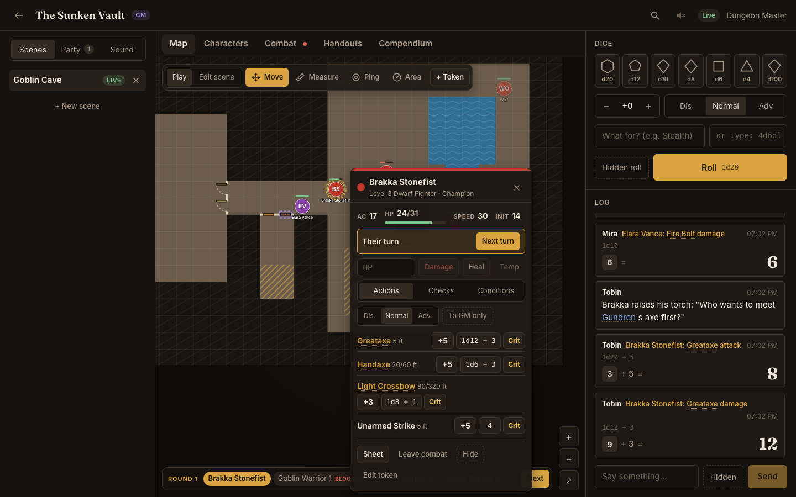
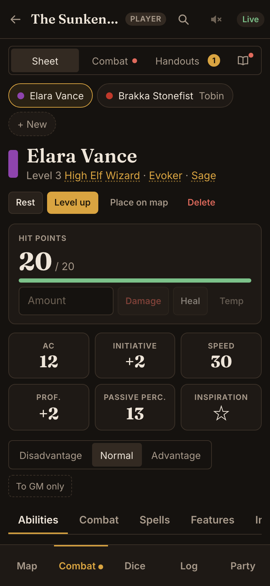
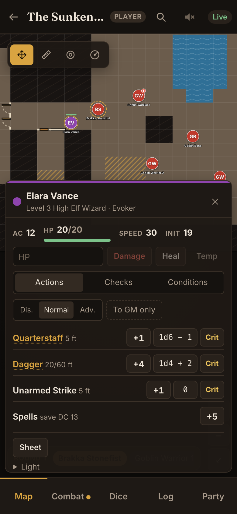
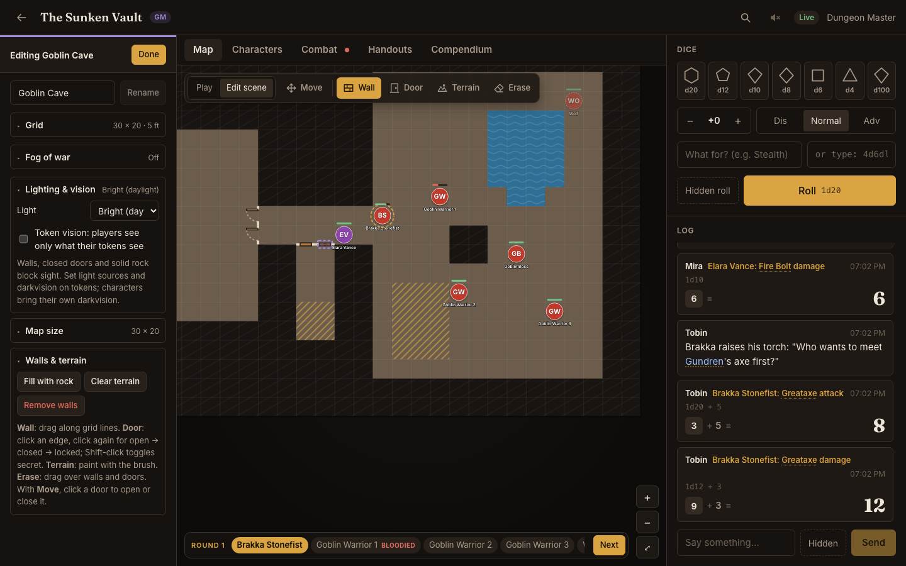
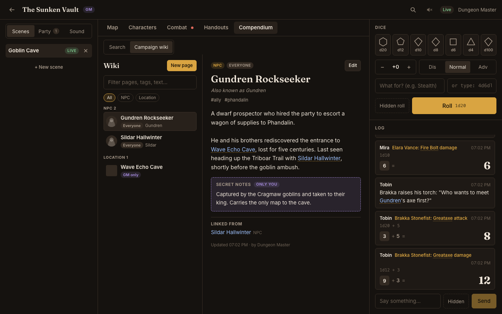
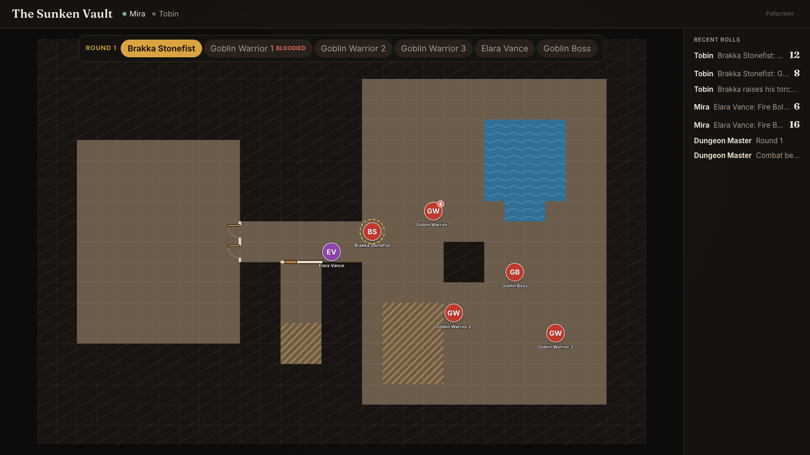
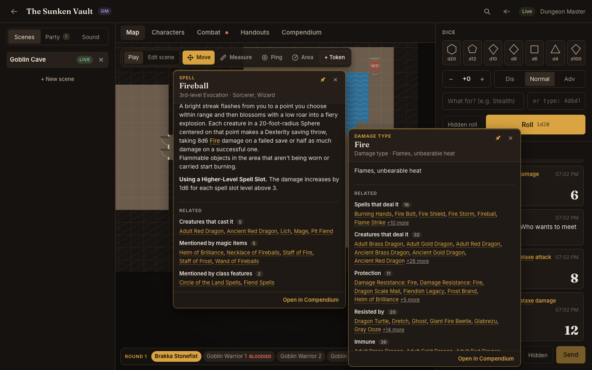

# dnd-table user guide

dnd-table puts your D&D 5e (2024 rules) game on every screen at the table. The GM runs it from a
laptop, players use their phones, and a TV shows the battle map to the room. Everything stays in sync
live, and each screen sees only what it's allowed to.

- [Getting started](#getting-started)
- [Finding your way around](#finding-your-way-around)
- [Playing a character](#playing-a-character)
- [Running the game (GM)](#running-the-game-gm)
  - [Preparing a scene](#preparing-a-scene)
  - [Tokens and quick actions](#tokens-and-quick-actions)
  - [Fog, light and vision](#fog-light-and-vision)
  - [Combat](#combat)
  - [Area templates](#area-templates)
  - [Handouts](#handouts)
  - [Campaign wiki](#campaign-wiki)
  - [Sound](#sound)
- [The table display](#the-table-display)
- [The knowledge base](#the-knowledge-base)
- [Reference](#reference)
- [Troubleshooting](#troubleshooting)

---

## Getting started

### 1. Start the server

One computer at the table (usually the GM's laptop) runs dnd-table; everyone else opens it in a web
browser over the same Wi-Fi. See [Running it](../README.md#running-it) in the README. When it starts
it prints the addresses to open:

```
  Open on this computer:  http://localhost:3000
  Open on your network:   http://192.168.0.12:3000
```

Give players the **network** address. Nothing needs installing on their phones.

### 2. Create accounts and a campaign

Everyone creates their own account (username, display name, password) on the sign-in page. If the
server was started with a signup code, they'll also need that code from the GM.

The GM presses **Create** under *Start a campaign*: whoever creates a campaign is its GM. The
campaign's **invite code** is in the GM's sidebar under **Party → Invite players**.

### 3. Join

Players enter the invite code under *Join a campaign* on their home screen, then tap the campaign.

### 4. Connect the TV (optional)

On the TV, projector or a spare laptop, open the server address and choose **Use this device as a
table screen** (or go straight to `/table`). It shows a short code. The GM enters it under
**Party → Table displays**. The screen stays paired after restarts; the GM can unpair it from the
same place.

---

## Finding your way around

### The GM's screen



- **Top bar:** campaign name, knowledge base search (Ctrl/⌘ K), audio for this device, connection
  status.
- **Left sidebar**, in three tabs:
  - **Scenes:** your maps. **Show** puts one in front of the players; **Live** marks the one they see.
  - **Party:** who's online, the invite code and table displays.
  - **Sound:** the soundboard. A green dot on the tab means something is playing.
- **Centre:** **Map**, **Characters**, **Combat** (a red dot while a fight is running), **Handouts**
  and **Compendium** (the knowledge base and campaign wiki).
- **Right:** the **dice tray** and the **log** (rolls, chat and whispers).

The map toolbar has two modes. **Play** holds what you use during a session: Move, Measure, Ping,
Area, the fog brushes, **+ Token**, the vision preview and *Table follows me*. **Edit scene** holds
what you use to prepare a map: Wall, Door, Terrain and Erase, with the scene's settings in the
sidebar. Press **Done** to go back to playing.

### A player's phone

The bottom bar switches between **Map**, **Sheet** (which also holds Combat, Handouts and the
Compendium, under the switch at the top), **Dice**, **Log** and **Party**. A dot on Sheet means a new
handout or wiki page is waiting. On a tablet or laptop, players get the same three-column layout as
the GM.

---

## Playing a character

### Creating a character

Open **Sheet** and press **Create a character**. The creator walks through the 2024 rules in order:
**Class → Background → Species → Abilities → Details → Equipment → Review**. Each step lists what
still needs choosing, and every rules term links to its description, so you can read what a feat or
feature does before picking it. Ability scores can be rolled, point-bought or taken from the
standard array.

### The character sheet



The sheet works everything out from your choices: AC, initiative, saves, skills, attacks, spell save
DC and so on.

- **Tap any bonus to roll it**: ability checks, saves, skills, attacks, damage and initiative. Pick
  **Advantage** or **Disadvantage** first; it applies to the next roll only. **To GM only** makes
  your rolls secret.
- **Hit points:** type an amount, then **Damage**, **Heal** or **Temp**. Damage comes off temporary
  HP first; at 0 HP the Combat tab shows death saves.
- **Conditions and exhaustion** (Combat tab) change your rolls automatically, e.g. Poisoned gives
  Disadvantage on attacks and checks, and Paralyzed fails Strength and Dexterity saves.
- **Spells:** slots, prepared spells and a spell picker for your class list. **Features** tracks
  class resources (Rage, Second Wind, Channel Divinity…). **Inventory** holds equipment, items and
  money. **Notes** are visible only to you and the GM.
- **Rest:** a Short Rest spends Hit Dice; a Long Rest restores everything.
- **Level up** walks through hit points, a subclass, feats or Ability Score Improvements and any new
  choices.
- **Place on map** puts your token on the scene in play.

### On the map



- **Drag your token** to move it. The label shows the distance, and the extra cost of difficult terrain
  ("30 ft (40 ft move)"). You can't move through walls, closed doors or solid rock.
- **Tap your token** for quick actions: hit points, conditions, your attacks and spell attack, checks
  and saves, ending your turn and your token's **Light** (light a torch, for instance). Tap another
  creature to see how hurt it looks and any conditions.
- **Measure** draws a ruler; **Ping** (or a double-tap) flashes a marker everyone sees; **Area**
  places spell templates (see [Area templates](#area-templates)).
- Drag empty map to pan; pinch or scroll to zoom.
- Click a door next to your token to open or close it, unless it's locked.

### In combat

The turn order runs along the bottom of the map. When it's your turn, your token is ringed and
**End turn** appears there and in your token's quick actions. Roll initiative from the sheet's
**Initiative** button or the tracker (or type in a physical roll); it goes straight into the order.

### Handouts and the wiki

Handouts the GM shares with you arrive in **Handouts** with a dot until you've read them. Wiki pages
shared with you appear in **Compendium → Campaign wiki**, and their names turn into links wherever
they're mentioned.

### Sound

The speaker button in the top bar turns the table's music and ambience on for your device (it's off by
default on phones) and sets your own volume.

---

## Running the game (GM)

### Preparing a scene



1. **Create a scene:** **Scenes → + New scene**. Upload a map image (PNG, JPEG, WebP or GIF), or
   leave it empty for a blank grid. New scenes are private until you press **Show**.
2. **Switch to Edit scene** in the map toolbar. The sidebar shows the scene's settings, each section
   with its current value on its summary line.
3. **Grid:** for an image map, set *Cells across* to the number of squares printed across the map,
   then nudge *Shift X/Y* until the lines match. *Feet per cell* is 5 in the 2024 rules. You can hide
   the grid lines.
4. **Map size** (blank maps): add or remove rows and columns on any side. Tokens, fog, walls and
   terrain stay where they are.
5. **Draw the map:**
   - **Wall:** drag along grid lines; a click places one edge.
   - **Door:** click an edge to add a door, click again to cycle open → closed → locked. Shift-click
     (or the *Secret door* toggle) makes it secret: players and the TV see a plain wall until it's
     opened.
   - **Terrain:** paint floor, solid rock (impassable), difficult terrain or water (both cost an extra
     5 ft per square). On a blank map, *Fill with rock* under **Walls & terrain**, then carve rooms
     with Floor.
   - **Erase** removes walls and doors. **Clear terrain** and **Remove walls** reset the whole map.
6. **Fog of war** and **Lighting & vision**: see [Fog, light and vision](#fog-light-and-vision).
7. Press **Done**, then **Show** (in the Scenes tab, or on the banner over the map) to put the scene
   in front of the players.

### Tokens and quick actions

- **+ Token** adds a creature, a hidden creature, a party member's character token, or a plain token
  for a player without a character. Monsters added from the combat tracker can place their own tokens.
- **Drag** to move; the GM can move anything, anywhere.
- **Click a token** for its quick actions, right beside it:
  - AC, hit points, speed and initiative, with **Damage / Heal / Temp**.
  - **Conditions**: shown as chips (× removes one); the Conditions tab toggles any of them.
  - **Actions** and **Checks**: a character's attacks, spell attack, checks, saves and skills from
    their sheet, or a monster's actions, checks and saves from its stat block. Monster rolls are
    hidden from players by default.
  - Whose turn it is, with **Next turn**, and **Roll** for a missing initiative.
  - **Start combat / Add to combat / Leave combat**, **Hide** and **Stat block** (or **Sheet** for a
    character).
  - **Edit token**: name, colour, size, who controls it, hidden, light, darkvision, blindsight,
    truesight, and **Remove token**.
- **Escape** closes the card; **Delete** removes the selected token.

### Fog, light and vision

**Fog of war** (Edit scene → Fog of war) hides unexplored areas from players. With fog on, the Play
toolbar gains **Reveal** and **Hide** brushes (1×, 3× or 5× wide); *Cover all* and *Reveal all* reset
it. Right-drag or two fingers still pan while painting.

**Lighting & vision** sets the scene's light: bright (daylight), dim (twilight, moonlight) or dark
(night, dungeons). With **Token vision** on, each player sees only what their own tokens see, and
table screens show what the whole party sees.

- Walls, closed doors and solid rock block sight. Creatures out of sight never reach players' devices.
- Give tokens light sources (candle, torch, lamp, hooded lantern, *Light*, *Daylight* or custom) and
  senses under **Edit token**. Character tokens take darkvision from the sheet.
- 2024 rules: dim light is lightly obscured, darkness heavily obscured. Darkvision sees dim light as
  bright and darkness as dim within its range; blindsight and truesight ignore light within theirs.
- **Dynamic fog** reveals whatever players see, so explored areas stay mapped (dimmed).
- You see everything, with light levels shaded and each light's reach outlined. Pick **As <player>**
  in the toolbar to preview exactly what that player sees.

### Combat

1. Start a fight from **Combat** (*Start with this map's tokens* or *Start empty*) or from any token's
   quick actions. Add party members, map tokens or SRD monsters: search by name or type and filter by
   CR. Monsters can drop their own tokens on the map, hidden if you like, with average or rolled HP.
2. **Roll for creatures** rolls initiative for every monster as a hidden roll. Players roll their own.
3. **Next turn** walks the order and announces each round. Players can end their own turn.
4. Apply damage, healing and conditions from the tracker or from token quick actions. A character's
   HP and conditions are the ones on their sheet, so everything stays in sync.
5. The tracker's **Stat block** tab shows the selected monster with tap-to-roll attacks, and the
   encounter's 2024 difficulty against your party's XP budget.

Players and the TV see the turn order and whose turn it is, but never hidden creatures, and only
*Healthy / Bloodied / Down* for creatures that aren't theirs.

### Area templates

1. Pick **Area**, then a spell (its shape and size come from the SRD, e.g. Fireball is a 20-foot-radius
   Sphere) or any shape and size: Cone, Cube, Cylinder, Emanation, Line or Sphere.
2. Press where the area starts and drag to aim. Caught creatures are ringed and counted. A square
   counts when the area covers at least half of it. An Emanation pressed on your token follows it.
3. Select a template (with Move) to drag it, turn it by its handle, resize or remove it, or post who's
   caught to the log for saving throws.
4. Templates disappear when the turn passes unless you tick **Keep**. The GM can hide templates or
   clear them all.

### Handouts

1. **Handouts → New handout**: a title, an optional image and text. **Preview** shows it as players will.
2. Share it with **Everyone** or **Some players**, or keep it a **Draft**. Players get a notice when
   one arrives; changing a shared handout marks it unread again.
3. **Show on table** puts it full-screen on the TV (tick *Also pop it up on players' screens* to show
   everyone). You can also put up any image straight away. **Back to map** takes it down.

### Campaign wiki



1. **Compendium → Campaign wiki → New page**: a title, a category (NPC, Location, Faction, Item, Lore,
   Session, Other), other names, tags, an image and text.
2. Type `[[` to link another page, a spell, a monster or a rule. Page titles and other names also link
   by themselves wherever they're written: handouts, chat, notes, other pages.
3. Choose who can read it: **GM only**, **Everyone** or **Some players**. **Secret notes** are never
   sent to players.
4. Each page lists the pages that link to it. A link to a page that doesn't exist yet offers
   **Create page**.

### Sound

1. **Sound → Add track**: upload MP3, OGG, WAV, M4A/AAC or FLAC (up to 50 MB). Choose **Music** (one at
   a time, crossfading), **Ambience** (layers that play together) or **Effects** (one-shots).
2. Play, pause and stop tracks; mix with each track's slider and the master volume. Click a track's
   name to rename it or change its kind, loop and default volume.
3. Table screens play the audio. Players opt in on their own devices. Someone joining mid-song hears
   it from the same point as everyone else.

---

## The table display



The TV needs no account. It shows the live scene with only what the party may see, the turn order,
recent public rolls (a new roll is spotlighted for a moment) and any handout you show. **Fullscreen**
is in its top-right corner.

- **Table follows me** (Play toolbar) makes the TV frame whatever you're looking at; otherwise it
  shows the whole map.
- Browsers only allow sound after an interaction, so the first time a TV needs a click or key press.
  For a kiosk, start Chrome with `--autoplay-policy=no-user-gesture-required`.

---

## The knowledge base



Every spell, monster, condition, item, class, feat, rule and campaign page is a link wherever it's
mentioned: sheets, stat blocks, the tracker, the log, handouts and the wiki. Each entry also lists
related entries worked out from the SRD: which spells deal Fire damage, which creatures resist it,
what protects against it, which weapons have a property, who casts a spell.

- **Hover** (mouse) to preview; **click** or **Ctrl/⌘-click** to pin. Links inside a popup open
  further popups beside it. On phones a tap opens a sheet.
- **Escape** closes the top popup. **Shift-click** a link (or *Open in Compendium*) to open the entry
  in the Compendium, with search, filters and back/forward history.
- **Ctrl/⌘ K** opens quick search: arrow keys to choose, **Enter** pins, **Shift+Enter** opens in the
  Compendium.
- In chat, handouts and wiki pages, write `[[Name]]` or `[[spell:fireball|that spell]]` to link
  explicitly.

---

## Reference

### Dice

Type expressions in the dice tray or pick dice and a modifier:

| You type      | Means                                               |
| ------------- | --------------------------------------------------- |
| `1d20+5`      | a d20 plus 5                                         |
| `2d20kh1+3`   | advantage: roll two d20, keep the highest, add 3     |
| `2d20kl1`     | disadvantage: keep the lowest                        |
| `4d6dl1`      | roll 4d6 and drop the lowest (ability scores)        |
| `8d6 + 1d4 - 1` | several terms                                      |
| `d%`          | percentile (1–100)                                   |

**Hidden roll** sends a roll to the GM only. Natural 20s and 1s on a single d20 are highlighted.

### Keyboard and mouse

| Action                            | How                                       |
| --------------------------------- | ----------------------------------------- |
| Quick search                      | Ctrl/⌘ K                                  |
| Close a popup or token card       | Escape                                    |
| Remove the selected token (GM)    | Delete or Backspace                       |
| Pan the map                       | drag empty map, right-drag, or two fingers |
| Zoom                              | scroll, pinch, or the + / − buttons       |
| Ping                              | double-click the map, or the Ping tool    |
| Toggle a secret door (editing)    | Shift-click it with the Door tool         |

---

## Troubleshooting

- **Players can't open the address.** They must be on the same network as the host. Use the
  *network* address the server prints, not `localhost`, and let Node.js through the host's firewall.
- **No sound on the TV.** Click or press a key on it once (see [The table display](#the-table-display)).
- **A player can't see the map.** Press **Show** on a scene; a scene you're preparing is private.
  With token vision on, players need a token that can see (light or darkvision) in a dark scene.
- **Backing up.** Everything lives in the `data/` folder: one SQLite database plus uploaded images and
  audio. Copy that folder while the server is stopped.
